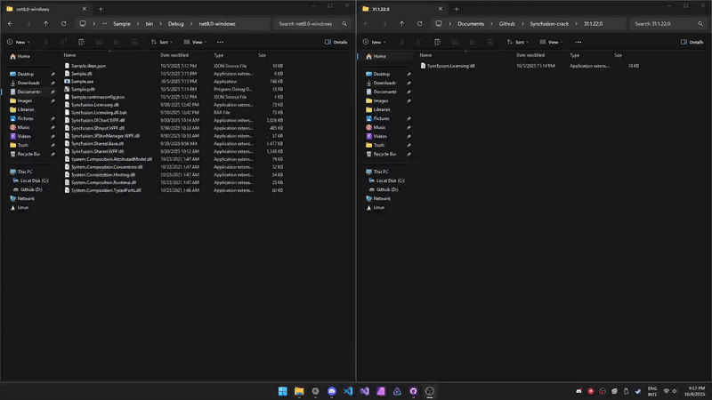

# Syncfusion crack

    
    
    
    

## Preview

## Information

    Please note that I am notified immediately whenever a new update is released. However, I am not always able to apply the patch as soon as the update becomes available.
    For standard updates, patching may occur shortly after release. For more complex versions, additional time may be required to ensure stability, compatibility, and proper implementation.
    Thank you for your understanding and patience.

## Explanation

  This repository was initially released to highlight that Syncfusion denied my request for a free developer license.
  Over time, I noticed that many developers were using Syncfusion and spending significant amounts of money on small-scale or personal projects far more than such components should cost.
  Additionally, this implementation bypasses few validation checks, resulting in a slight performance improvement due to reduced decoding and encoding overhead.

## Usage
- Navigate to the releases tab: [Releases](https://github.com/Neotoxic-off/Syncfusion-crack/releases)
- Download the required file (VERSION.zip)
- Extract the archive
- Copy the .dll inside the folder version of your project
- Replace your project file
- Done

## Help

  If a new version is released or a bug is found in the cracked version, please create an issue, and I will address it as soon as possible
  If you’re unsure about a crack found online, please verify its authenticity by comparing its signature with the official ones listed

## Signatures
### Core
| Release date | Platform  | Version     | Sha256                                                           |
|--------------|-----------|-------------|------------------------------------------------------------------|
| 2025-10-15   | Core      | 31.2.2      | 546a2a998503969e15c1e3216c52eced83042124696cfa6eb8b2594920d31a43 |
| 2025-10-22   | Core      | 31.2.3      | 2037b2c5758493392f9ec5be4749b155c6f07ee6fe805399d5bb450a8767a0ab |
| 2025-10-28   | Core      | 31.2.4      | 9a009d62a5ea46a50dfaa66061be7838fa714219b73a640df7e4fb9f21bffa40 |
| 2025-12-09   | Core      | 31.2.18     | 31deb10fedad5eeb182847d01555193a5f3dd0d7824a3d2834105344bf75142b |
| 2025-12-16   | Core      | 32.1.19     | a3a09dffc46f02120f63a05b40618702bef35632457f16bd2517d9897148c3a9 |

### Framework
| Release date | Platform  | Version     | Sha256                                                           |
|--------------|-----------|-------------|------------------------------------------------------------------|
| 2025-10-15   | Framework | 31.2.2      | be61d81cb339ab56d8045722d6c0bc786353e6dc6785bac99e09069a0b691f3e |
| 2025-10-22   | Framework | 31.2.3      | 4156e67ff3503885646e003cde31a65776a01dcc3be884bd61e4eeaab69a2b41 |
| 2025-10-28   | Framework | 31.2.4      | f01f076878760c72cf32eadd6bc15d612242c2e4b05ee3f46d5249f462c346bf |
| 2025-12-09   | Framework | 31.2.18     | 1a94854d67d2d151c9b64bfede3413cd2b55050cf02c26749fc9918f6a637a74 |
| 2025-12-16   | Framework | 32.1.19     | 05a31d9ef2d849fe52559ee6d10aad2b5be861f35887578474af9472043e7d49 |
